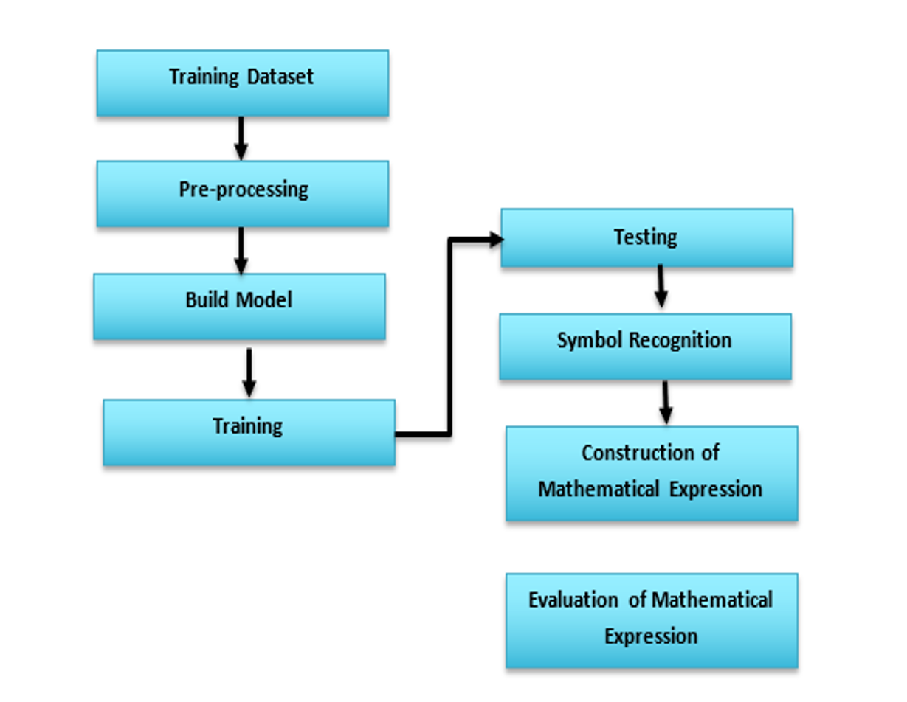
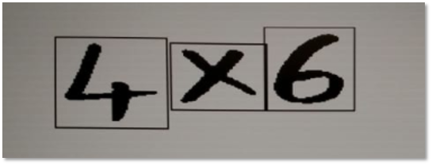

# Recognition and Evaluation of Handwritten Mathematical Expressions

## Method

Recognition and evaluation of handwritten mathematical expressions typically consists of 6 major stages: pre-processing, segmentation, feature extraction, symbol classification, construction of mathematical expression and evaluation of mathematical expression. The architecture of recognition and evaluation of mathematical expression for training and testing dataset in shown in figure.

### Mathematical Expression

The mathematical expression is captured via webcam and OpenCV. The frames which are collected from webcam are in BGR format which is converted into gray scale image and sent for image pre-processing. 

### Pre-pre-processing

The quality of the image can be improved through pre-processing. Gray scale image is converted into binary image. It is further processed by applying Otsu Binarization. Morphological transformations are applied to the images as it removes noise. We have applied both the morphological operators Erosion followed by Dilation as erosions removes the small white noises, detach connected objects. Since erosion shrinks are object we dilate it to increase the area of the object and join the broken parts of an object.

### Segmentation

In segmentation, the input is segmented into individual symbols.  The segmentation is now performed by threshold function. We chose adaptive thresholding as the image would have different lighting conditions in different areas. Adaptive thresholding algorithm calculates the threshold for small regions of the image. By doing so, we get different thresholds for different regions of the same image and thus yield better results for images having different lightning conditions.

### Contour Extraction

Contours are used for object detection and recognition. In accordance with OpenCV, the object to be recognized is in white while the background is in black. The parameters given to contours are source image (In our case the segmented or threshold image), the hierarchy (Chose RETR_TREE as it retrieves the entire hierarchy of the image) and the approximation method of contour(CHAIN_APPROX_SIMPLE). We take into consideration the contour area greater than 40 and a straight bounding rectangle where the height(length) is greater than 23. We wrote rules to fix the issue for symbols that contain two shapes like “=”.  

### Construction of Mathematical Expressions

To construct mathematical expressions are being constructed based on the x and y cooridinates of the start of the elements that make up the expression.

### Classification (Convolutional Neural Network)

Classification (Convolutional Neural Network)

#### Convolution Layer:

This is the main operation in CNN and we have 8 convolution layers. It will compute the output of neurons that are connected to local regions in the input. We decreased the filter size as we moved to other layers (140,120,100,100,90,90,80) with kernel size of 5 * 5. This structure was chosen as it gave us the highest accuracy. We assigned the value “same” for border_mode as it does some padding around the input image, thus making the output image size same as that of input. The activation function we used for all the 8 layers is relu.

#### Max Pooling:

We used pooling layer for the first 5 convolutional layers. It basically reduces the spatial size i.e. height and width (not depth). The size of the filter maps is reduced as we apply max filter to the non-overlapping sub regions. The total number of filter maps is reduced by a factor of 4 by using 2 * 2 max filters (pooling size=2). We have given a stride of (2,2) which specifies how much we need to shift the kernel in each step to compute the next pixel in the result (stride size same as pool size by default).

#### Fully Connected Layer:

To complete the model architecture, we flatten the output from the previous layers and enter a fully connected layer. The fully connected layer is declared using Dense() layer. We have taken 500 nodes each activated by relu function. Next, used SoftMax classification in the output layer which is the size of the total number of classes so that we could get one node per class label.

## Evaluation of Mathematical Expressions

As SymPy doesn’t validate the mathematical expression but evaluates, some functions to check the validity of the expressions are developed. These functions help in removing the noisy contours detected by OpenCV and pass a valid expression to SymPy.

## Results
